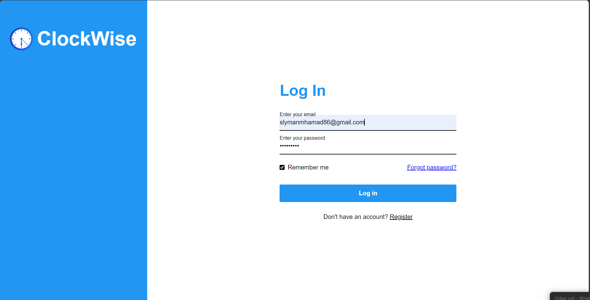

# ClockWise - Personal Time Management & Study Assistant

## 📋 Overview

ClockWise is a comprehensive web-based time management and study assistant application built with PHP, MySQL, HTML, CSS, and JavaScript. It helps users organize their schedules, manage study sessions, store recordings, and maintain contacts in one integrated platform.

## 📸 Screenshots

### 🏠 Home Dashboard

*Main dashboard showing today's agenda, calendar view, and quick access buttons*

### 🔐 Login & Registration

*Secure login interface with remember me functionality*


*User registration form with validation*

### 📅 Calendar Management

*Full calendar interface with event scheduling and management*

### ⏰ Study Timer

*Pomodoro timer with start, pause, and reset controls*

### 🎵 Recording Storage

*File upload and management interface for audio recordings*

### 👥 Contact Form

*Contact form with email integration*

## ✨ Features

### 🏠 **Home Dashboard**
- Personalized greeting based on time of day
- Today's agenda display with event management
- Quick access buttons for study sessions and recordings
- Interactive calendar view with navigation
- Event statistics (today, this week, this month)
- Holiday information display
- Profile picture management with upload/remove functionality

### 📅 **Calendar Management**
- Full calendar view with week navigation
- Event scheduling with detailed information
- Event editing and deletion capabilities
- Color-coded events for better organization
- Date-based event filtering

### ⏰ **Study Timer**
- Customizable Pomodoro timer (default 25 minutes)
- Start, pause, and stop functionality
- Audio notifications when timer completes
- Session persistence across page refreshes
- Reset timer functionality

### 🎵 **Recording Storage**
- File upload system for audio recordings and PDFs
- Supported formats: MP3, WAV, M4A, OGG, PDF
- Maximum file size: 3GB
- Duplicate file detection
- File deletion capabilities
- Secure file storage in database

### 👥 **Contact Management**
- Contact form with subject and message fields
- Direct email integration using mailto links
- Form validation and sanitization

### 🔐 **User Authentication**
- Secure login and registration system
- Password hashing for security
- Remember me functionality
- Session management
- Profile picture support

## 🛠️ Technology Stack

- **Backend**: PHP 7.4+
- **Database**: MySQL
- **Frontend**: HTML5, CSS3, JavaScript
- **Server**: XAMPP (Apache)
- **File Storage**: Database BLOB storage

## 📁 Project Structure

```
ClockWise/
├── home page/                 # Main application files
│   ├── home.php              # Dashboard and main interface
│   ├── calendar.php          # Calendar view and management
│   ├── recordings.php        # File upload and management
│   ├── startStudying.php     # Study timer functionality
│   ├── contact.php           # Contact form
│   ├── schedule_now.php      # Event scheduling
│   ├── editEvent.php         # Event editing
│   ├── deleteEvent.php       # Event deletion
│   ├── upload.php            # Profile picture upload
│   ├── removeProfilePic.php  # Profile picture removal
│   ├── logout.php            # Session logout
│   ├── schedule.js           # JavaScript for scheduling
│   ├── *.css                 # Stylesheet files
│   └── icons/                # Application icons
├── login/                    # Authentication system
│   ├── login.php            # User login
│   ├── signup.php           # User registration
│   ├── connection.php       # Database connection
│   ├── style.css            # Login styles
│   └── background.jpg       # Login background
└── README.md                # This file
```

## 🗄️ Database Schema

### Tables

#### `admins`
- `first_name` (VARCHAR(50)) - User's first name
- `last_name` (VARCHAR(50)) - User's last name
- `email` (VARCHAR(100)) - Primary key, user's email
- `password` (VARCHAR(255)) - Hashed password
- `profile_pic` (LONGBLOB) - Profile picture data

#### `events`
- `id` (INT) - Auto-increment primary key
- `user_email` (VARCHAR(100)) - Foreign key to admins
- `event_name` (VARCHAR(255)) - Event title
- `event_description` (TEXT) - Event details
- `event_date` (DATE) - Event date
- `event_start_time` (TIME) - Start time
- `event_finish_time` (TIME) - End time
- `sync_status` (VARCHAR(200)) - Event status

#### `recording`
- `id` (INT) - Auto-increment primary key
- `email` (VARCHAR(100)) - Foreign key to admins
- `recording_name` (VARCHAR(255)) - File name
- `recording_file` (LONGBLOB) - File data

## 🚀 Installation & Setup

### Prerequisites
- XAMPP (Apache + MySQL)
- PHP 7.4 or higher
- MySQL 5.7 or higher

### Installation Steps

1. **Clone or Download the Project**
   ```bash
   # Place the project in your XAMPP htdocs directory
   C:\xampp\htdocs\ClockWise\
   ```

2. **Start XAMPP Services**
   - Start Apache and MySQL services in XAMPP Control Panel

3. **Database Setup**
   - The application automatically creates the database and tables on first run
   - Database name: `mydb`
   - Default credentials: `root` (no password)

4. **Access the Application**
   - Open your browser and navigate to: `http://localhost/ClockWise/login/login.php`

5. **Create Your Account**
   - Register a new account using the signup form
   - Login with your credentials

## 🔧 Configuration

### Database Connection
Edit `login/connection.php` if you need to change database settings:
```php
$server_name = "localhost";
$username = "root";
$password = "";
$db_name = "mydb";
```

### File Upload Settings
- Maximum file size: 3GB (configurable in `recordings.php`)
- Supported file types: MP3, WAV, M4A, OGG, PDF

## 📱 Features in Detail

### Event Management
- **Create Events**: Schedule new events with name, description, date, and time
- **Edit Events**: Modify existing events through the calendar interface
- **Delete Events**: Remove events with confirmation
- **View Events**: See events organized by day, week, or month

### Study Timer
- **Pomodoro Technique**: 25-minute focused study sessions
- **Customizable**: Adjust timer duration as needed
- **Audio Alerts**: Notification sound when timer completes
- **Session Control**: Start, pause, stop, and reset functionality

### File Management
- **Secure Storage**: Files stored as BLOB in database
- **Duplicate Prevention**: System prevents duplicate file uploads
- **Format Support**: Multiple audio and document formats
- **Easy Access**: Quick navigation to recordings from dashboard

## 🔒 Security Features

- **Password Hashing**: Secure password storage using PHP's `password_hash()`
- **SQL Injection Prevention**: Prepared statements for all database queries
- **Session Management**: Secure session handling with authentication checks
- **Input Sanitization**: All user inputs are sanitized and validated
- **File Upload Security**: File type and size validation

## 🎨 User Interface

- **Responsive Design**: Works on desktop and mobile devices
- **Modern UI**: Clean, intuitive interface with smooth animations
- **Navigation**: Easy-to-use sidebar navigation
- **Visual Feedback**: Interactive elements with hover effects
- **Color Coding**: Events and features are color-coded for better organization

## 🔄 Session Management

- **Auto-logout**: Sessions expire when browser is closed
- **Remember Me**: Optional persistent login
- **Security**: Automatic redirect to login for unauthorized access
- **Profile Persistence**: User preferences and settings maintained

## 📊 Usage Statistics

The application tracks and displays:
- Events scheduled for today
- Events scheduled for the current week
- Events scheduled for the current month
- Study session statistics

## 🛠️ Development

### Adding New Features
1. Create new PHP files in the appropriate directory
2. Update the navigation menu in existing files
3. Add corresponding CSS styles
4. Update database schema if needed

### Customization
- Modify CSS files to change the appearance
- Update JavaScript files for enhanced functionality
- Add new database tables for additional features

## 🐛 Troubleshooting

### Common Issues

1. **Database Connection Error**
   - Ensure MySQL is running in XAMPP
   - Check database credentials in `connection.php`

2. **File Upload Issues**
   - Verify file size is under 3GB
   - Check file format is supported
   - Ensure proper file permissions

3. **Session Issues**
   - Clear browser cookies
   - Restart Apache server
   - Check PHP session configuration

## 📝 License

This project is developed for educational and personal use.

## 👨‍💻 Developer

ClockWise is developed as a comprehensive time management solution for students and professionals.

---

**Note**: This application is designed to run on a local XAMPP server. For production deployment, additional security measures and server configuration may be required. 